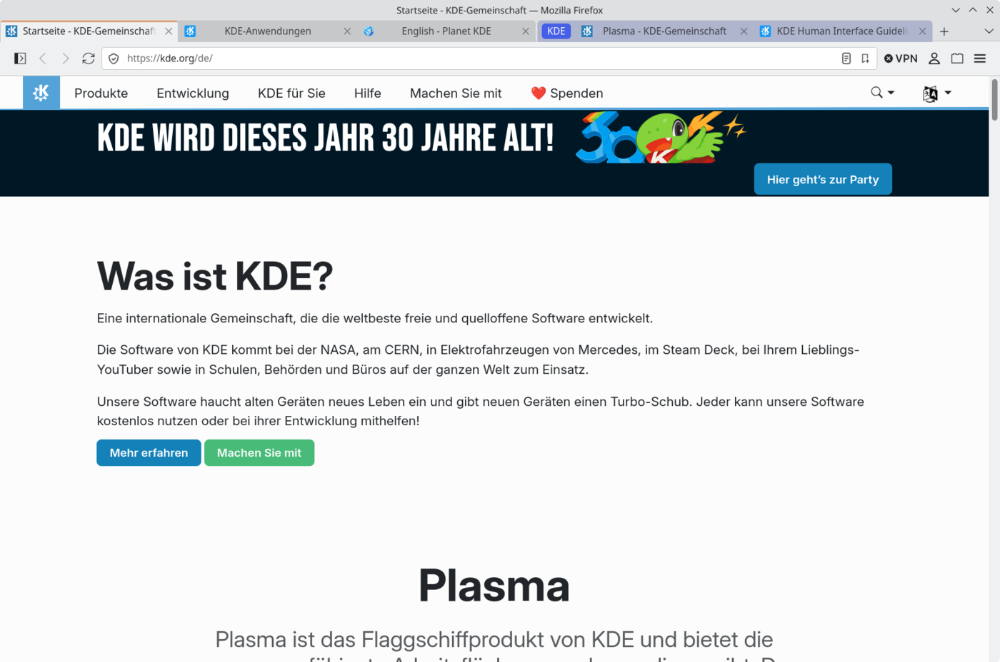

# Firefox KDE theme

A userChrome theme that makes Firefox fit into KDE Plasma. I used [Falkon](https://www.falkon.org/) as the reference and Breeze / the KDE HIG where Falkon has nothing comparable.

<br clear="left"/>



Based on the [Firefox GNOME theme](https://github.com/rafaelmardojai/firefox-gnome-theme) (install scripts and structure), the look is KDE only.

Colors aren't hardcoded, they come from your KDE color scheme through the Breeze GTK theme, so light/dark and the accent color follow Plasma. Icons are Breeze icons.

Tested with Firefox 156 and 157 (Flatpak) on Plasma 6. It changes a lot of Firefox internals, so if something looks broken, check vanilla Firefox first.

## Requirements

- Plasma 6 with the Breeze GTK theme for GTK apps (the default)
- For Flatpak Firefox also the Flatpak version of it:

	```sh
	flatpak install flathub org.gtk.Gtk3theme.Breeze
	```

## Install

```sh
git clone https://github.com/Amphero/firefox-kde-theme.git
cd firefox-kde-theme
./scripts/auto-install.sh
```

Then restart Firefox. `auto-install.sh` installs into every profile it finds. For a single profile or a custom Firefox folder use `install.sh`:

```sh
./scripts/install.sh -f ~/.var/app/org.mozilla.firefox/config/mozilla/firefox -p xxxxxxxx.default-release
```

The script copies the theme to `chrome/firefox-kde-theme`, adds the imports to `userChrome.css` / `userContent.css` and the prefs from [`configuration/user.js`](configuration/user.js) to the profile's `user.js` (old one kept as `user.js.bak`). A Firefox GNOME theme install gets replaced.

Manual install: copy the repo to `<profile>/chrome/firefox-kde-theme`, put `@import "firefox-kde-theme/userChrome.css";` into `chrome/userChrome.css` and `@import "firefox-kde-theme/userContent.css";` into `chrome/userContent.css`, and set the prefs from `configuration/user.js`.

To update, pull and run the script again. To uninstall, delete `chrome/firefox-kde-theme` and the two imports.

## Preferences

Set by `configuration/user.js`:

- `toolkit.legacyUserProfileCustomizations.stylesheets` – needed, otherwise nothing is loaded
- `svg.context-properties.content.enabled` – colors the icons
- `browser.tabs.inTitlebar = 0` – Plasma title bar like Falkon
- `browser.theme.dark-private-windows = false` – private windows keep the KDE colors
- `widget.gtk.overlay-scrollbars.enabled = false`, `widget.non-native-theme.scrollbar.size.override = 16` – Breeze-like scroll bars
- `browser.urlbar.trimURLs = false` – full URL like Falkon

Optional (booleans in about:config):

- `kdeTheme.noThemedIcons` – keep Firefox's icons
- `kdeTheme.showQuitMenuItem` – show *Quit* in the app menu

Own tweaks go into `chrome/firefox-kde-theme/customChrome.css` and `customContent.css`, they survive updates.

## Known issues

- Flatpak Firefox only picks up a new accent color (e.g. from the wallpaper) after a restart. Plasma reloads GTK colors with `colorreload-gtk-module`, which isn't in the Flatpak runtime.
- The accent color is only reachable as `-moz-buttonactiveface` and doesn't work through CSS variables, so it's written out in the parts. A few places use the selection color instead.
- Scroll bars in web pages keep Firefox's own handle color.

## Development

Theme entry point is `theme/kde-theme.css`, the parts are in `theme/parts/`, about: pages in `theme/content.css`. The icons are generated from the installed Breeze icons:

```sh
python3 theme/icons/gen_icons_css.py
```

The Browser Toolbox (<kbd>Ctrl</kbd>+<kbd>Alt</kbd>+<kbd>Shift</kbd>+<kbd>I</kbd>, enable chrome and remote debugging in the dev tools settings first) is the easiest way to inspect the UI.

## Credits

Based on the Firefox GNOME theme by Rafael Mardojai CM and contributors. Breeze icons from KDE's [breeze-icons](https://invent.kde.org/frameworks/breeze-icons) (LGPL-3.0-or-later). The theme itself is public domain, see [LICENSE](LICENSE).
